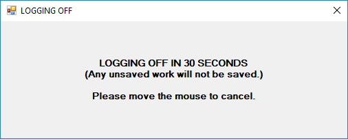

# Idle User Logoff
A simple C# application that logs the user off a Windows user account after a set amount of time. Includes a popup window countdown and easy to change settings file.

Being C# and developed in Visual Studio 2017, this application is made to run on a Windows machine. Development takes place on a Windows 10 desktop and the project uses .NET Framework 2.0. The application should be able to run on previous versions of Windows without problem, but I leave that up to the user to find out.
